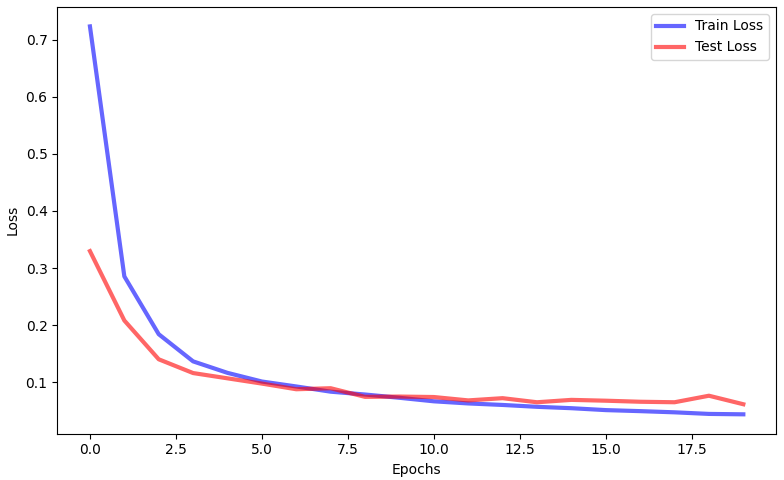
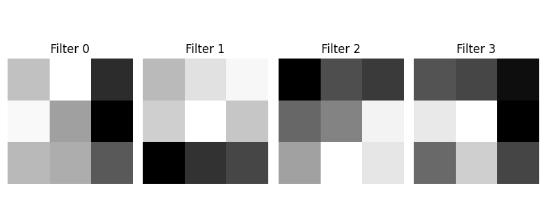

# CNN on MNIST dataset
This project implements a Convolutional neural network on the MNIST dataset and provides visualizations of the model.

## Architecture
The CNN is defined as a single `nn.Sequential` block in `model.py` file:
- Conv2d(in_channels=1, out_channels=4, kernel_size=3, padding=1)
- ReLU
- Conv2d(input_channels=4, out_channel=8, kernel_size = 3, padding=1),
- ReLU
- MaxPool2d(kernel_size=2)
- Flatten
- Linear(in_features=8 * 14 * 14, out_features=32),
- ReLU
- Linear(in_features=32, out_features=10)

## Visualization
#### 1. Loss Plot
Shows the train and test loss over epochs.
#### 2. Kernel Visualization
Shows the learned filters in the first convolution layer. Each one captures different features.
#### 3. Feature Map Visualization
For a batch of 5 images from the dataset, it displays:
- The first channel of the feature map after the first convolution layer. 
- The first channel of the feature map after the second convolution layer.
- The original image with the model's prediction.

## Results

Final Training Loss = 0.0438






## How to Run
First run the following command in your terminal:
```bash
python train.py
```
This trains the model and saves 3 files: 
- `test_loss.npy` storing the test loss over training epochs.
- `train_loss.npy` storing the train loss over training epochs.
- `parameters.pth` storing the model parameters.
Then run the next command:
```bash
python visualize.py
```
It displays train-test loss plot, Filters, feature maps, and predictions.

## Notes
MNIST dataset, `.npy` loss files and parameters `parameters.pth` are not included in the repository.
Make sure to run `train.py` before `visualize.py` to generate these files.

