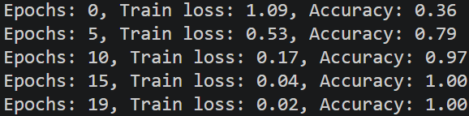
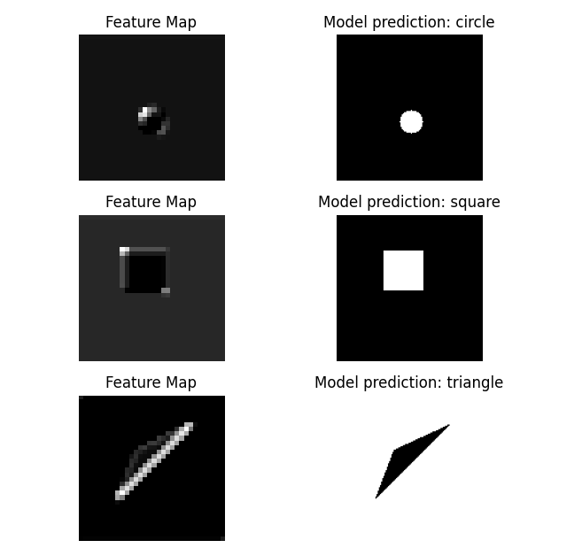
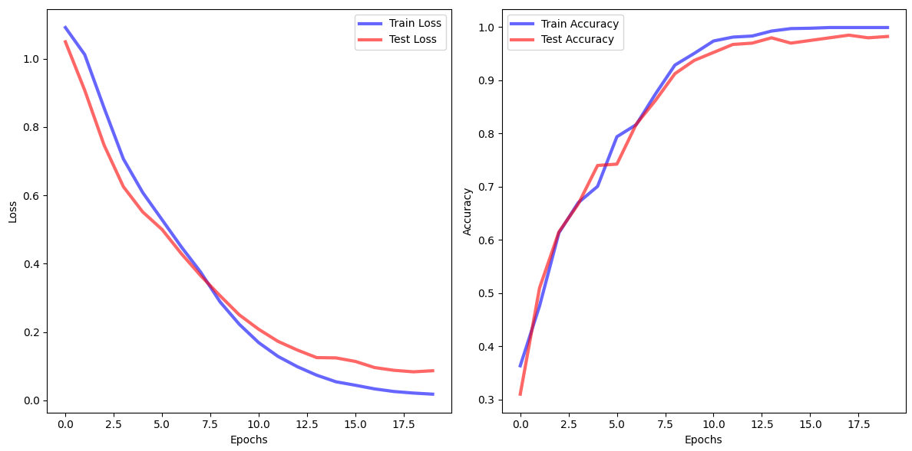

# Shape Recognition
This project is a Pytorch Cnn model that generates synthetic image data of circles, squares, and triangles. It trains a classifier model and visualizes the loss, accuracy, and feature maps after the second convolution layer.
### Dataset
The data is generated after running the file `data_generator.py`. Each image is a 128×128 grayscale image with:
- Random shape from circles, triangles, and squares with random size.
- Black or White background.
- saved as PNG
### Architecutre
- Conv2d(in_channel=1, out_channel=4, kernel_size=3, padding=1)
- ReLU
- MaxPool2d(size=2)

- Conv2d(in_channel=4, out_channel=8, kernel_size=3, padding=1)
- ReLU
- MaxPool2d(size=2)

- Linear(in_features=8 * 32 * 32, out_features=32)
- ReLU
- Linear(in_features=32, out_features=3)
### Training
- Loss: CrossEntropyLoss
- Optimizer: Adam(lr = 0.001)
- Epochs: 20
- Batch size: 64
During training the following information is printed:
- train/test loss per epoch
- train/test accuracy per epoch
### Results
Plots:
- Train and test loss curve
- Train and test accuracy curve
- Feature maps after the second convolution layer + Example predictions with the actual image







### How to Run
```bash
python data_generator.py
python train.py
python visualize.py